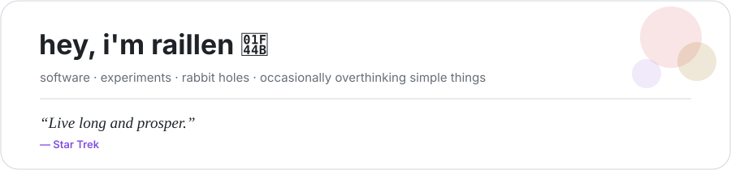
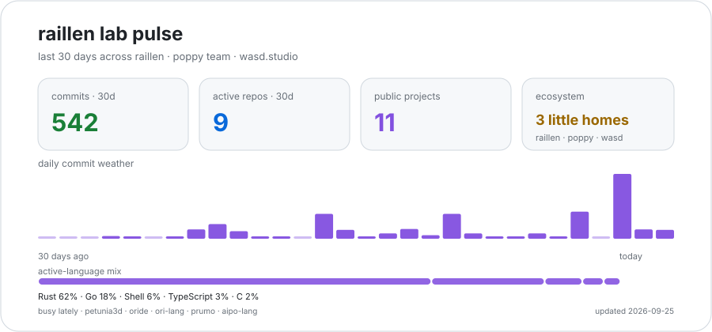

  <picture>
    <source media="(prefers-color-scheme: dark)" srcset="./assets/header-dark.svg">
    <source media="(prefers-color-scheme: light)" srcset="./assets/header-light.svg">
    
  </picture>

  
  
  
  

I make software, tools, experiments, and occasionally things that started as *"this should be simple"* and somehow became a whole project.

I like programming languages, developer tools, UI/UX, graphics, 3D, lightweight desktop software, and whatever rabbit hole looks interesting that week.

Most things here:

- exist because I wanted to **learn, test, rethink, or overthink something**;
- probably had **AI helping somewhere along the way**;
- tend to favor **simple, fast, modular, and accessible software**;
- are very much a **work in progress**;
- and are here for you to **download, tweak, break, fix, fork, remix, and be happy.**

## the little ecosystem around here

<table>
<tr>
<td width="50%" valign="top">

### 🌺 [Poppy Team](https://github.com/poppy-team)

Where programming languages, developer tools, and harness grow.

**Aipo** is a small language with a bytecode VM and JavaScript backend.  
**Ori** explores reading-first native language design and lower cognitive load.  
**Oride** is a lightweight, modular terminal mini-IDE.  
**Prumo** is a Git-native harness and protocol CLI for projects with humans and AI agents.  

Compilers, tooling, language experiments, and developer systems.

</td>
<td width="50%" valign="top">

### 🎮 [WASD.studio](https://github.com/wasd-lat)

Tools and creative software for game development, design, and 3D.

**Petunia3D** is a native low-poly modeler focused on fast PS1/N64/DS-style asset creation, with an OpenGL-first path for older and lighter hardware.  
**Photoshow** is a fast local photo and texture viewer/editor built around Rust + egui.  
**HummSuite** is home to lightweight desktop media apps (HummTube, HummIPTV and HummMusic).  
Future home for game engines, design tools, and games themselves.

Less cloud. Less waiting. More *open it, craft, and play*.

</td>
</tr>
<tr>
<td width="50%" valign="top">

### 🌐 [raillen.com](https://raillen.com)

My little place outside GitHub.

Projects, experiments, notes, and writings about technology, design, and AI.

</td>
<td width="50%" valign="top">

### 🛠️ [raillen](https://github.com/raillen)

Personal experiments & desktop software.

**Tidyflow** is a local-first desktop automation app for keeping files organized.  
Plus experimental lab work, agent setups, and open-source prototypes.

</td>
</tr>
</table>

## a few things growing right now

- 🌱 **[Aipo](https://github.com/poppy-team/aipo-lang)** — a small language with two backends that are expected to agree with each other.
- 🌿 **[Ori](https://github.com/poppy-team/ori-lang)** — reading-first language design, native code, compiler study, and accessibility-minded syntax.
- 🧰 **[Oride](https://github.com/poppy-team/oride)** — a lightweight terminal editor / mini-IDE that wants to stay fast and contained.
- 🧭 **[Prumo](https://github.com/poppy-team/prumo)** — a Git-native protocol and CLI harness for projects with humans and AI agents.
- 🌸 **[Petunia3D](https://github.com/wasd-lat/petunia3d)** — a native low-poly modeler for fast retro-style asset creation, with an OpenGL-first path for modest hardware.
- 🖼️ **[Photoshow](https://github.com/wasd-lat/photoshow)** — a fast local photo and asset viewer/editor without databases or clouds getting in the way.
- 🐝 **[HummSuite](https://github.com/wasd-lat/hummsuite)** — lightweight desktop media apps with a local-first mindset.
- 🗂️ **[Tidyflow](https://github.com/raillen/tidyflow)** — local-first desktop automation for keeping files organized.

## numbers that probably shouldn't be taken too seriously

  <picture>
    <source media="(prefers-color-scheme: dark)" srcset="https://github-readme-stats.vercel.app/api?username=raillen&show_icons=true&hide_border=true&theme=github_dark&rank_icon=github">
    <source media="(prefers-color-scheme: light)" srcset="https://github-readme-stats.vercel.app/api?username=raillen&show_icons=true&hide_border=true&theme=default&rank_icon=github">
    
  </picture>
  <picture>
    <source media="(prefers-color-scheme: dark)" srcset="https://github-readme-stats.vercel.app/api/top-langs/?username=raillen&layout=compact&langs_count=8&hide_border=true&theme=github_dark">
    <source media="(prefers-color-scheme: light)" srcset="https://github-readme-stats.vercel.app/api/top-langs/?username=raillen&layout=compact&langs_count=8&hide_border=true&theme=default">
    
  </picture>

  

  <picture>
    <source media="(prefers-color-scheme: dark)" srcset="./assets/lab-pulse-dark.svg">
    <source media="(prefers-color-scheme: light)" srcset="./assets/lab-pulse-light.svg">
    
  </picture>

The language card describes repository composition, not skill level, spiritual alignment, or which language I will suddenly decide to rewrite everything in next week.

---

No grand master plan here.

Just making things, learning in public, rewriting them three times, and having fun along the way.

**Have fun. ✨**
